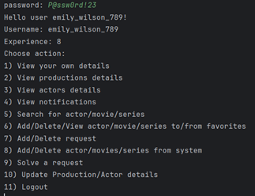
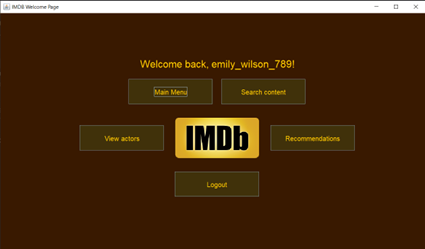
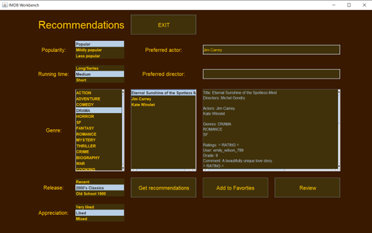
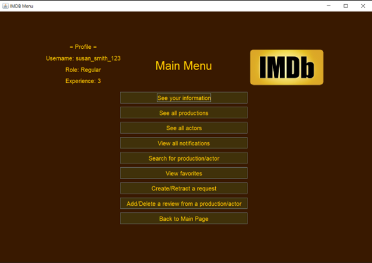

# Tema POO 2023 - IMDB Ion Daniel 325CC
## Cerința temei
Internet Movie Database (IMDB) este o bază de date online care conține informații extinse despre filme, emisiuni TV, actori, regizori, producători și alte elemente legate de industria cinematografică și de televiziune. Este una dintre cele mai mari și mai populare resurse online pentru informații despre filme și seriale TV, oferind recenzii, ratinguri, date de lansare și multe altele.

Proiectul propune crearea unei astfel de baze de date folosind principiile programării orientate pe obiect și funcționalitățile puse la dispoziție de limbajul de programare JAVA, aplicând noțiunile studiate în cadrul acestui curs.

## Grad de dificultate: 8.50 / 10
Gradul de dificultate acordat se datorează mai mult cantității mari de muncă pe care această temă o necesită pentru a o duce la bun sfârșit, implementarea ei nefiind una foarte complexă la nivel de teorie, ci la nivel de structură. Cel mai mult timp a fost acordat implementării comenzilor pe care un utilizator le poate efectua în funcție de rolul său și plasării acestor comenzi într-o interfață grafică/într-un terminal. 

### Timp implementare: > 30 ore

## Implementare
În realizarea acestui proiect, am căutat să respect cu strictețe cerințele oferite, dezvoltând concomitent funcționalități bonus care să se completeze cu structura cerută.

### 1.	Pre-interface
Pentru a prezenta implementarea, voi începe cu locul de unde pornește flow-ul aplicației, anume din clasa IMDB, din run(). La început, extrag datele din fișierele JSON în funcția doParse(), având grijă ca atunci când este întâlnit un actor care nu se află în baza de date, acesta să fie trecut, cu performanța găsită, în lista de actori a bazei de date folosind funcția addUnknownActor(). De asemenea, rating-urile și request-urile citite din JSON sunt trecute în liste corespunzătoare aflate în clasa User și Staff, astfel că un request este asociat atât celui care trimite request-ul, printr-o listă de requesturi create, cât și celui care primește request-ul printr-o listă de request-uri primite, iar rating-urile sunt asociate fiecărui Regular care a realizat un review asupra unei producții, într-o listă de perechi de tip <String,Rating>, unde string-ul este exact numele producției/actorului căruia i-a fost realizat review-ul. Întregul parsing a fost realizată cu ajutorul bibliotecii json-simple.

### 2.	Interface – Choice & Auth
În urma parsingului, utilizatorul poate alege între cele 2 interfețe, CLI și GUI, primind un mesaj în terminal cu ajutorul căruia acesta poate ajunge la zona de autentificare. Mesajul, aflat în chooseCLIGUI(), așteaptă un input de tip integer – 1 pentru CLI și 2 pentru GUI. În cazul în care utilizatorul alege 1, acesta va fi întâmpinat de un mesaj în terminal, fiind trimis în zona de autentificare specifică interfeței alese, iar în cazul în care utilizatorul alege 2, o fereastră se va deschide, cerând emailul și parola utilizatorului care dorește să se conecteze. Pentru cazul al doilea, am creat o clasă AuthGUI unde am implementat designul și logica din spatele autentificării. Ideea de bază din spatele autentificării este căutarea emailului user-ului în lista de useri din baza de date și verificarea dacă parola pe care userul găsit o are este aceeași cu cea a celui ce dorește să se conecteze. În cazul în care parolele sunt aceleași, utilizatorul este trimis către un meniu în cazul CLI sau către un welcome page în cazul GUI, iar username-ul său este salvat pe tot parcursul sesiunii, datele sale putând fi accesate și modificate până când acesta iese din cont sau până când aplicația este oprită.

### 3.1. Welcome Page
Ajungând la Welcome Page, utilizatorul poate acum să interacționeze prin diferite moduri cu aplicația, în funcție de rolul pe care acesta îl deține. În cazul CLI (Img. 1), utilizatorul este întâmpinat cu un meniu cu comenzi indexate pe care acesta le poate folosi pentru a afla mai multe informații despre propriul său profil, despre producții, despre actori, să adauge producții/actori la favorite etc. În cazul GUI (Img. 2.), utilizatorul are posibilitatea de a folosi mai multe butoane, acestea fiind implementate în clasa WelcomePage. „Main Menu” duce către un meniu asemănător celui din interfața CLI, doar că sub format grafic, folosind butoane, „Search” content permite căutare în întreg sistemul a actorilor/producțiilor, „View actors” permite vizionarea tuturor actorilor din baza de date, iar „Recommendations” este zona în care utilizatorul poate aplica diferite filtre pentru a obține recomandări de filme/actori, după propriile sale preferințe. “Logout” conduce utilizatorul înapoi la pagina de autentificare.

    

        
        
Img. 1. Interfață CLI pentru un utilizator de tip Contributor

    

    

        
        
Img. 2. Interfață GUI cu diverse butoane

    

### 3.2. More on Welcome Page – GUI
Întrucât funcționalitățile butoanelor “Search”, “View actors” și “Search content” sunt implementate deja în zona de meniu, voi prezenta momentan doar implementarea zonei de recomandări.
Pentru recomandări (Img. 3.), am decis să implementez 7 filtre diferite, cu ajutorul cărora utilizatorul poate găsi diferite filme/seriale care să se încadreze cerințelor, primind totodată ca recomandare actorii care au jucat în producțiile respective. Utilizatorul poate totodată din zona de recomandări să adauge la favorite și să adauge o recenzie (dacă userul are rangul Regular) producției alese sau actorului ales.

    
    
Img. 3. Interfață Recommendations pentru un utilizator de tip Regular

După cum se poate observa, cele 7 filtre pe care utilizatorul le poate folosi sunt Popularity, Running time, Genre, Release, Appreciation, Preferred actor și Preferred director. Logica din spatele filtrelor este următoarea:
*	Popularity – filtru care verifică numărul de rating-uri pe care o producție o are. Pentru ca o producție să fie considerată Popular, aceasta trebuie să aibă 5 sau peste 5 rating-uri, pentru Mildly popular, între 3 și 5, iar pentru Less popular sub 3 rating-uri.
*	Running time – filtru care verifică durata unei producții. Pentru ca o producție să fie considerată Long, aceasta trebui să fie un serial sau un film cu durata de peste 150 minute, pentru Medium, un film cu durata între 100 și 150 de minute, iar pentru Short, sub 100 de minute.
*	Genre – filtru care verifică dacă filmul/serialul ales are genul ales din listă. Este singurul filtru ce permite mai multe stări, adică utilizatorul este capabil să caute, concomitent un film care conține, de exemplu, atât DRAMA, cât și SF.
*	Release – filtru care verifică anul când s-a lansat serialul/filmul. Pentru ca o producție să fie considerată Recent, aceasta trebuie să aibă anul de lansare mai mare de 2015, pentru a fi considerată a 2000’s Classic, între 2000 și 2015, și pentru a fi considerată Old School 1900, să fie sub anul 2000.
*	Appreciation – filtru care verifică rating-ul average al producției. Pentru ca o producție să fie considerată Very liked, aceasta trebuie să aibă un rating average de peste 9, pentru Liked, un average rating între 7 și 9, iar pentru mixed, un rating sub 7.
*	Preferred actor – filtru care verifică dacă actorul ales se află în lista de actori ce joacă în producție.
*	Preferred director – filtru care verifică dacă directorul ales se află în lista de directori a producției.

Apăsând pe Get recommendations, utilizatorul primeste astfel recomandări în functie de ceea ce a ales.

### 4. Main Menu - CLI & GUI
Meniul are, în mare parte, același conținut atât în terminal cât și pe interfața grafică, singura diferență fiind aceea că utilizatorul este capabil, în cadrul GUI-ului, să revină la welcome page, în timp ce pe terminal, pentru a ieși din meniu, există o singură soluție – logout. Acest buton de revenire la welcome page înlocuiește practic funcția de logout din terminal, butonul de deconectare fiind plasat pe welcome page. Design-ul meniului pentru interfața grafică(Img. 4.) se află în interiorul clasei MenuGUI, iar funcționalitățile fiecărui buton se află în clasa ActionGUI. Meniul și funcționalitățile pentru terminal se află în clasa IMDB, funcția goCLI() reprezentând, practic, atât interfața cât și manager-ul de funcționalități al meniului.

    
    
Img. 4. Interfață grafică Main Menu pentru un utilizator de tip Regular

Atât meniul din interfața GUI, cât și meniul din interfața grafică, conțin toate funcționalitățile enunțate în cerința temei, acestea fiind implementate prin manipularea datelor utilizatorului înregistrat. Singurul utilizator capabil, într-o oarecare măsură, să manipuleze datele altor utilizatori sunt adminii, care au capacitatea de a modifica informațiile de pe profilul utilizatorilor.

### 5. Patterns
În cadrul acestui proiect, am implementat următoarele Pattern-uri:
*	Singleton Pattern pentru a restricționa numărul de instanțe al clasei IMDB
*	Builder Pattern pentru a facilita crearea unui obiect de tip Information
*	Factory Pattern pentru a instanția utilizatorii din sistem cu rangul lor specific – Admin, Contributor, Regular
*	Observer Pattern pentru a implementa funcționalitatea notificărilor
*	Strategy Pattern pentru a implementa modalități diferite ca utilizatorul să obțină experiență în urma adăugării unei recenzii, crearea unei cereri rezolvate, adăugarea unei producții sau a unui actor nou. Pentru adăugarea unei recenzii, utilizatorul primește 1 punct experiență, pentru crearea unei cereri rezolvata, 2 puncte, iar pentru adăugarea producțiilor, 3 puncte.

### 6. Bonus
Ca bonus, am decis ca utilizatorul să poată, atunci când folosește terminalul, să poată să se întoarcă oricând (cu câteva excepții) înapoi în meniul terminalului folosind comanda “exit”.

În plus, am mai adăugat opțiunea ca un utilizator să fie capabil să-și vadă propriile sale date înregistrate în bază, iar adminii au acum posibilitatea de a schimba datele atât ale utilizatorilor care nu sunt admini, cât și propriile lor date de profil.

De asemenea, am adăugat posibilitatea de a oferi rating-uri unui actor, realizând o implementare similară cu procesul de a da rating-uri unei producții.

Pentru a avea o pagină de recomandări riguroasă, am implementat 5 filtre în plus față de filtrele care au fost recomandate, anume filtrul de durată Running time, filtrul pentru anul de lansare Release, filtrul pentru rating-ul average Appreciation, filtrul pentru actorul preferat Preferred actor și filtrul pentru directorul preferat Preferred director.
